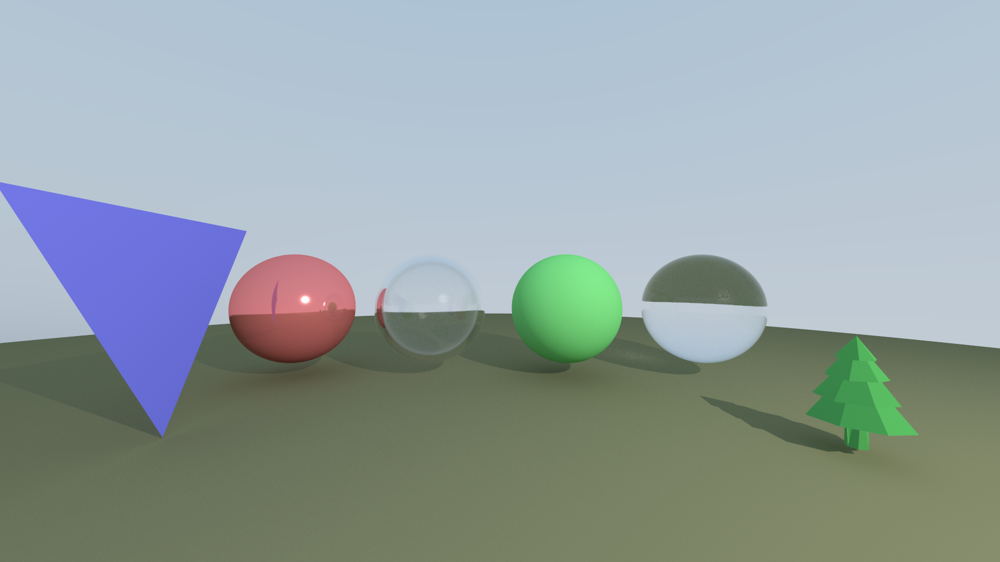

# Rust ray tracer
This is an educational project to learn the Rust programming language and ray tracing fundamentals.
Based on [_Ray Tracing in One Weekend_](https://raytracing.github.io/books/RayTracingInOneWeekend.html)

Extensions to the book:
- Shadows / directional light
- Multiple light sources
- K-d Tree for space division and faster ray intersection checks
- Triangles and meshes (WIP, currently not optimized)
- Reading .obj files (only subset of specification supported)
- Multiprocessing
- Dynamic resampling of pixels with high variance color values
- Bounding boxes for intersection-test speedup

Note that not all formulas for calculating brightness, reflection, etc. are necessarily "correct" or standard practice. They are a mixture of what is efficient (enough), looks good, and seemed plausible.

While creating this project, I also came across this website called [Scratchapixel](https://www.scratchapixel). It is currently (August 2022) still WIP but already has a ton of useful information, like the math of triangle ray intersection which was very handy. If I were to redo this project, I would probably follow this guide from start to finish. I also recently noticed that the original resource is actually just the first in a 3-book series. You can find the other books here: https://raytracing.github.io/

Current render:
